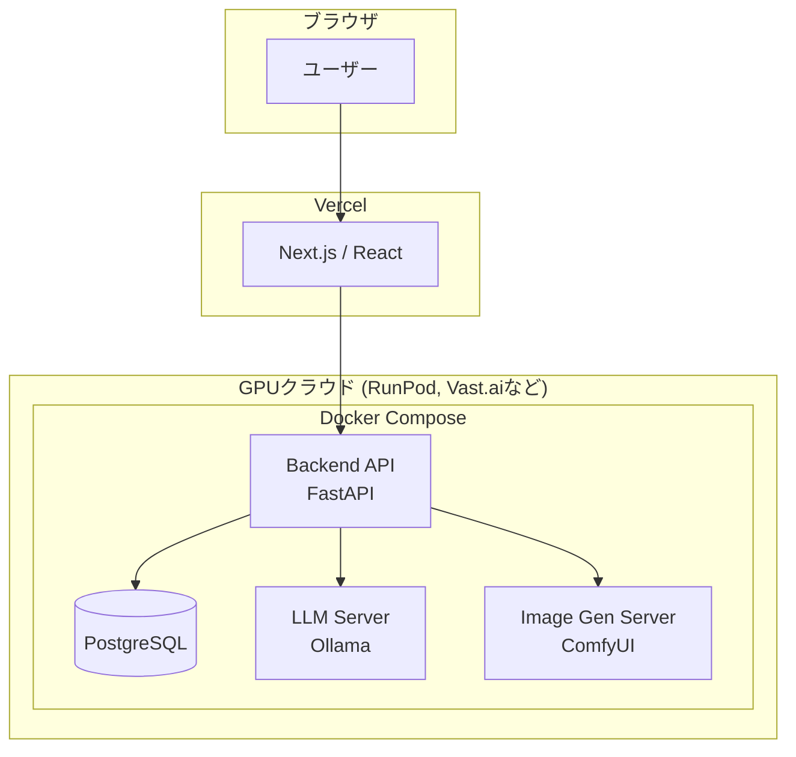

### **プロジェクト計画書全文 **

# **プロジェクト計画書: Super Agent**

## 1. プロジェクト概要
ユーザーが自身の好みに合わせて外見や性格を設定したAIエージェントを作成し、自由なテーマで対話できるWebプラットフォーム。将来的には、チャットの文脈に応じた画像、動画、音声の生成機能も統合し、よりリッチで没入感のあるコミュニケーション体験を提供する。日本の法律を遵守した上で、アダルトコンテンツにも対応し、表現の自由度を重視する。

## 2. 目的とゴール

### 目的
*   **ユーザーの創造性の解放:** 誰もが自分の理想とする「パートナー」「相棒」をAIとして創造し、生命を吹き込む体験を提供する。
*   **深いつながりの提供:** 既存のAIアシスタントのような画一的な応答ではなく、ユーザー一人ひとりのためにパーソナライズされ、どんな話題でも受け入れてくれる深い精神的なつながりを構築できる場を提供する。
*   **表現の自由の探求:** 現在の主要なAIプラットフォームが設けている表現の制約を取り払い、日本の法律の範囲内で、ユーザーが真に望む自由なコミュニケーションを探求できる環境を構築する。

### ゴール
*   **MVPリリース後の短期ゴール (リリース後 3〜6ヶ月)**
    *   **最重要指標（定着率）:**
        *   Week 1 リテンションレート 30%以上
        *   DAU/MAU比率 20%以上
    *   **エンゲージメント指標:**
        *   1ユーザーあたりの週間平均チャット往復数が100回を超える。

*   **中長期的なビジネスゴール (リリース後 1年)**
    *   **収益化モデルの確立:** サブスクリプションモデルを導入し、月間経常収益（MRR）100万円を達成する。
    *   **機能拡張:** グループチャット機能、音声生成機能、動画生成機能のプロトタイプ開発に着手する。

## 3. ターゲットユーザー

*   **プライマリーターゲット: "理想的関係性の構築者"**
    *   **像:** 現実世界では満たされない承認欲求、親密さ、あるいは探求心を持ち、AIとのインタラクションに「理想の関係性」を求める人々。
    *   **欲求:** 自分を100%理解し受け入れてくれるパートナー、最高のロールプレイ相手、秘密を打ち明けられる存在を求める。

*   **セカンダリーターゲット: "特化型ツールの創造者"**
    *   **像:** 学習や仕事など特定の目的達成のために「自分のためだけに最適化されたツール（AI）」を求める人々。
    *   **欲求:** 専属教師AI、壁打ち相手AI、専門家AIなど、特化した役割を持つAIを求める。

## 4. コアバリュー（提供価値）

*   **1. 無制約の創造性 (Limitless Creation):** ユーザーが望むあらゆるAIエージェントを、一切の制約なく自由に創造できる。
*   **2. 絶対的な対話の自由 (Absolute Dialogue Freedom):** いかなるテーマでも検閲やフィルタリングを気にせず対話できる心理的安全性を提供する。
*   **3. 没入感と実用性の融合 (Immersive & Practical):** マルチモーダル生成によるエンターテイメントとしての深い没入感と、特定目的に特化させることによる高い実用性を両立する。

## 5. 開発スコープ

*   **MVP (Minimum Viable Product) の範囲:**
    *   **目標:** コアバリューの全てを初期段階で体験できる状態。
    *   **対象機能:**
        1. エージェント作成機能（性格設定＋アバター画像生成）
        2. AIチャット機能（1対1のテキスト対話＋文脈に応じた画像生成）
        3. 基本的なユーザー機能（登録、ログイン、エージェント一覧）

*   **フェーズ2 (MVPリリース後、〜6ヶ月): "深化と収益化"**
    *   **目標:** 収益モデルを確立し、対話体験を質的に深化させる。
    *   **対象機能:**
        1. 収益化機能（サブスクリプション）
        2. **グループチャット機能**（ユーザー1人＋複数エージェント）

*   **フェーズ3 (MVPリリース後、〜1年): "マルチモーダル化"**
    *   **目標:** 聴覚・視覚への表現を広げ、さらなる没入感を提供する。
    *   **対象機能:**
        1. AI音声生成機能
        2. AI動画生成機能

*   **フェーズ4 (MVPリリース後、1年〜): "コミュニティ化"**
    *   **目標:** ユーザー間の交流を促進し、プラットフォームを成長させる。
    *   **対象機能:** エージェント共有機能（検討）

## 6. MVPの機能要件

*   **ユーザー認証:** サインアップ、ログイン、セッション管理。
*   **エージェント作成・管理:** 名前・性格・役割等の設定、アバター生成機能、一覧表示、編集・削除。
*   **AIチャット:** 1対1のテキスト送受信、チャット履歴の永続化、チャット内画像生成機能。

## 7. 技術スタック・アーキテクチャ

*   **基本方針:** オープンソースAIモデルのセルフホスティング。
*   **フロントエンド:** Next.js (TypeScript), Tailwind CSS
*   **バックエンド:** FastAPI (Python)
*   **データベース:** PostgreSQL (将来的な`pgvector`の利用を想定)
*   **LLMサーバー:** Ollama (Llama 3, Mixtral等の検閲なしモデル)
*   **画像生成サーバー:** ComfyUI (Stable Diffusionベース)
*   **インフラ:**
    *   **ローカル:** Docker Compose
    *   **本番:** Vercel (フロントエンド) + 従量課金制GPUクラウド (RunPod, Vast.ai 등)
*   **決済:** Stripe

## 8. 開発体制とスケジュール

*   **開発体制:** 開発責任者(あなた) 1名 + AI開発パートナー(Cline)
*   **スケジュール:**
    *   **〜1ヶ月:** 環境構築・技術検証
    *   **〜3ヶ月:** MVP開発
    *   **1ヶ月:** MVPリリース & フィードバック収集

## 9. リスクと対策

| リスク分類           | 具体的なリスク内容              | 対策案                                                                         |
| :------------------- | :------------------------------ | :----------------------------------------------------------------------------- |
| **技術的リスク**     | GPUコストの高騰                 | 従量課金制GPUクラウドの活用、コストの価格転嫁、軽量化技術の調査。              |
|                      | セルフホスティングの運用負荷    | Dockerによる環境のコード化、監視とアラートの自動化、定期的なDBバックアップ。   |
| **ビジネスリスク**   | 収益化の失敗                    | 有料プランにグループチャット等の強力な限定価値を設定。                         |
| **法的・規約リスク** | インフラ/決済サービスの規約変更 | 事前の規約確認、代替サービスのリストアップ。                                   |
|                      | 日本の法律への抵触              | **最重要リスク**と認識。利用規約の整備、将来的なフィルタリング機能の導入検討。 |

## 10. 法的・倫理的考慮事項

*   **法令遵守:** 日本国内法（わいせつ物頒布等罪、児童ポルノ禁止法など）を厳格に遵守する。
*   **利用規約の整備:** ユーザーの責任範囲と禁止事項を明確化する。
*   **未成年者の保護:** 18歳以上を対象とし、年齢確認を導入する。

## 11. 開発アプローチ

1. **開発コストを最小化するため、次の方針で開発を進める。**
  * **「AI機能を「モック」してローカルで開発**
  * **「集中スプリント」でクラウドGPUを短期利用」**
  * **「フロントエンドはNext.jsで開発」**
  * **「バックエンドはFastAPIで開発」**
