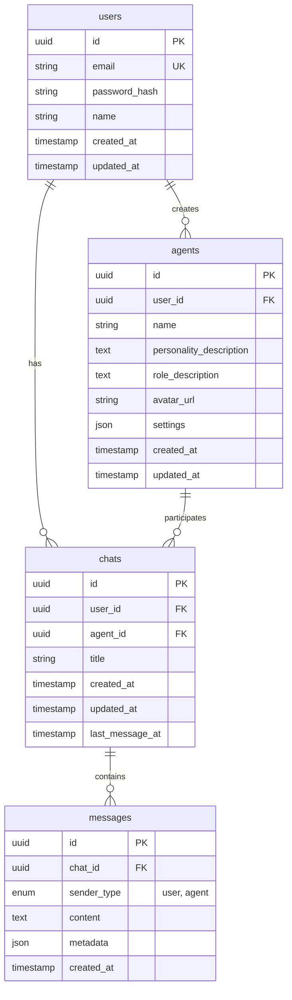

# データベーススキーマ設計

## ER図

## テーブル詳細説明

### users テーブル
- **目的**: ユーザーアカウント情報を管理
- **主要フィールド**:
  - `id`: UUID形式の主キー
  - `email`: ユニークなメールアドレス（ログイン用）
  - `password_hash`: パスワードのハッシュ値
  - `name`: ユーザーの表示名

### agents テーブル
- **目的**: ユーザーが作成したAIエージェントの情報を管理
- **主要フィールド**:
  - `id`: UUID形式の主キー
  - `user_id`: 作成者のユーザーID（外部キー）
  - `name`: エージェントの名前
  - `personality_description`: 性格設定のテキスト
  - `role_description`: 役割設定のテキスト
  - `avatar_url`: アバター画像のURL
  - `settings`: その他の設定をJSON形式で保存

### chats テーブル
- **目的**: ユーザーとエージェント間のチャットセッションを管理
- **主要フィールド**:
  - `id`: UUID形式の主キー
  - `user_id`: チャット参加者のユーザーID（外部キー）
  - `agent_id`: チャット参加者のエージェントID（外部キー）
  - `title`: チャットのタイトル
  - `last_message_at`: 最後のメッセージの送信時刻

### messages テーブル
- **目的**: チャット内のメッセージを管理
- **主要フィールド**:
  - `id`: UUID形式の主キー
  - `chat_id`: 所属するチャットのID（外部キー）
  - `sender_type`: 送信者タイプ（'user' または 'agent'）
  - `content`: メッセージ本文
  - `metadata`: 生成画像URLなどの追加情報をJSON形式で保存

## 将来の拡張性
- グループチャット機能への対応を考慮し、chatsテーブルは1対1チャットから多対多に拡張可能な設計
- messagesテーブルのmetadataフィールドで画像、音声、動画などのマルチモーダルコンテンツを格納可能