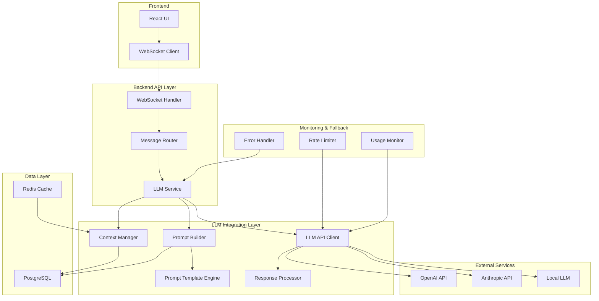

# エージェントパーソナリティ対応LLM統合アーキテクチャ設計書

## 1. エグゼクティブサマリー

本設計書は、既存のSuperAgentシステムにおいて、エージェントの豊富なパーソナリティ情報（性格、役割、口調、背景）を活用し、LLM（Large Language Model）を統合してパーソナライズされた応答を生成するシステムのアーキテクチャを定義します。

### 主要な設計目標
- エージェントのパーソナリティ情報を効果的に活用した応答生成
- スケーラブルで保守しやすいプロンプトテンプレート管理
- 会話履歴のコンテキスト管理によるコヒーレントな対話
- 堅牢なエラーハンドリングとフォールバック機構
- パフォーマンスとコストの最適化

## 2. 現在のシステム分析

### 2.1 既存のデータモデル

```python
# エージェントのデータ構造
Agent:
  - id: Integer (Primary Key)
  - name: String
  - description: String
  - gender: String
  - background: Text
  - personalities: List[Personality] (多対多)
  - roles: List[Role] (多対多)
  - tones: List[Tone] (多対多)
  - owner_id: Integer (Foreign Key)

# 会話関連のデータ構造
Chat:
  - id: Integer (Primary Key)
  - user_id: Integer
  - agent_id: Integer
  - messages: List[Message]

Message:
  - id: Integer (Primary Key)
  - chat_id: Integer
  - content: String
  - sender: String ("user" | "ai")
  - image_url: String (Optional)
  - created_at: DateTime
```

### 2.2 現在の課題
- チャット機能がモック実装（`/api/v1/chat/mock`）
- エージェントのパーソナリティ情報が活用されていない
- 固定のレスポンス「これはモックサーバーからの返信です。」

## 3. 提案するアーキテクチャ

### 3.1 全体アーキテクチャ図



### 3.2 コンポーネント設計

#### 3.2.1 LLM Service (中核サービス)

```python
# backend/services/llm_service.py

from typing import Dict, List, Optional
from abc import ABC, abstractmethod
import asyncio

class LLMService:
    """LLM統合の中核サービス"""
    
    def __init__(
        self,
        prompt_builder: PromptBuilder,
        context_manager: ContextManager,
        llm_client: LLMClientInterface,
        response_processor: ResponseProcessor,
        error_handler: ErrorHandler
    ):
        self.prompt_builder = prompt_builder
        self.context_manager = context_manager
        self.llm_client = llm_client
        self.response_processor = response_processor
        self.error_handler = error_handler
    
    async def generate_response(
        self,
        message: str,
        agent_id: int,
        chat_id: int,
        user_id: int
    ) -> Dict[str, Any]:
        """エージェントのパーソナリティを反映した応答を生成"""
        try:
            # 1. エージェント情報とコンテキストを取得
            agent = await self.get_agent_with_personality(agent_id)
            context = await self.context_manager.get_context(chat_id)
            
            # 2. プロンプトを構築
            prompt = await self.prompt_builder.build(
                agent=agent,
                message=message,
                context=context
            )
            
            # 3. LLM APIを呼び出し
            raw_response = await self.llm_client.generate(prompt)
            
            # 4. 応答を処理・検証
            processed_response = await self.response_processor.process(
                raw_response=raw_response,
                agent=agent
            )
            
            # 5. コンテキストを更新
            await self.context_manager.update_context(
                chat_id=chat_id,
                user_message=message,
                ai_response=processed_response["content"]
            )
            
            return processed_response
            
        except Exception as e:
            return await self.error_handler.handle(e, message, agent_id)
```

#### 3.2.2 Prompt Builder (プロンプト構築)

```python
# backend/services/prompt_builder.py

class PromptBuilder:
    """エージェントのパーソナリティを反映したプロンプトを構築"""
    
    def __init__(self, template_engine: PromptTemplateEngine):
        self.template_engine = template_engine
    
    async def build(
        self,
        agent: Agent,
        message: str,
        context: List[Dict[str, str]]
    ) -> str:
        """プロンプトを構築"""
        
        # パーソナリティ情報を構造化
        personality_info = self._extract_personality_info(agent)
        
        # テンプレートを選択
        template = self.template_engine.get_template(
            personalities=agent.personalities,
            roles=agent.roles
        )
        
        # プロンプトを生成
        prompt = template.render(
            agent_name=agent.name,
            agent_description=agent.description,
            agent_background=agent.background,
            personalities=personality_info["personalities"],
            roles=personality_info["roles"],
            tones=personality_info["tones"],
            gender=agent.gender,
            conversation_history=context,
            user_message=message
        )
        
        return prompt
    
    def _extract_personality_info(self, agent: Agent) -> Dict:
        """エージェントのパーソナリティ情報を抽出・整形"""
        return {
            "personalities": [p.name for p in agent.personalities],
            "roles": [r.name for r in agent.roles],
            "tones": [t.name for t in agent.tones]
        }
```

#### 3.2.3 Prompt Template Engine

```python
# backend/services/prompt_template_engine.py

from jinja2 import Template, Environment, FileSystemLoader
import yaml

class PromptTemplateEngine:
    """プロンプトテンプレートの管理と選択"""
    
    def __init__(self, template_dir: str = "templates/prompts"):
        self.env = Environment(loader=FileSystemLoader(template_dir))
        self.template_registry = self._load_template_registry()
    
    def get_template(
        self,
        personalities: List[Personality],
        roles: List[Role]
    ) -> Template:
        """最適なテンプレートを選択"""
        
        # ルールベースでテンプレートを選択
        template_name = self._select_template(personalities, roles)
        
        # テンプレートをロード
        return self.env.get_template(template_name)
    
    def _select_template(
        self,
        personalities: List[Personality],
        roles: List[Role]
    ) -> str:
        """パーソナリティと役割に基づいてテンプレートを選択"""
        
        # デフォルトテンプレート
        template = "default.j2"
        
        # 役割ベースの選択
        role_names = [r.name for r in roles]
        if "カスタマーサポート" in role_names:
            template = "customer_support.j2"
        elif "教師" in role_names:
            template = "teacher.j2"
        elif "エンジニア" in role_names:
            template = "engineer.j2"
        
        # パーソナリティによる調整
        personality_names = [p.name for p in personalities]
        if "フレンドリー" in personality_names and "カジュアル" in personality_names:
            template = f"casual_{template}"
        
        return template
```

#### 3.2.4 プロンプトテンプレート例

```jinja2
{# templates/prompts/default.j2 #}

あなたは{{ agent_name }}という名前のAIアシスタントです。

【基本情報】
- 名前: {{ agent_name }}

- 説明: {{ agent_description }}


- 性別: {{ gender }}


【背景】

{{ agent_background }}

特定の背景情報はありません。


【性格特性】

- {{ personality }}


【役割】

- {{ role }}


【話し方・口調】

- {{ tone }}


【会話履歴】

{{ msg.sender }}: {{ msg.content }}


【重要な指示】
1. 上記の性格特性、役割、口調を必ず守って応答してください
2. 背景情報がある場合は、それに沿った知識や経験を活かしてください
3. 一貫性のあるキャラクターとして振る舞ってください
4. ユーザーとの関係性を考慮し、適切な距離感を保ってください

ユーザー: {{ user_message }}

{{ agent_name }}:
```

#### 3.2.5 Context Manager (コンテキスト管理)

```python
# backend/services/context_manager.py

from typing import List, Dict
import redis
import json

class ContextManager:
    """会話履歴とコンテキストを管理"""
    
    def __init__(
        self,
        db: Session,
        redis_client: redis.Redis,
        max_context_length: int = 10,
        context_ttl: int = 3600  # 1時間
    ):
        self.db = db
        self.redis = redis_client
        self.max_context_length = max_context_length
        self.context_ttl = context_ttl
    
    async def get_context(self, chat_id: int) -> List[Dict[str, str]]:
        """会話コンテキストを取得"""
        
        # Redisからキャッシュを確認
        cache_key = f"context:chat:{chat_id}"
        cached = self.redis.get(cache_key)
        
        if cached:
            return json.loads(cached)
        
        # DBから履歴を取得
        messages = self.db.query(Message)\
            .filter(Message.chat_id == chat_id)\
            .order_by(Message.created_at.desc())\
            .limit(self.max_context_length)\
            .all()
        
        # コンテキストを構築
        context = [
            {
                "sender": msg.sender,
                "content": msg.content,
                "timestamp": msg.created_at.isoformat()
            }
            for msg in reversed(messages)
        ]
        
        # キャッシュに保存
        self.redis.setex(
            cache_key,
            self.context_ttl,
            json.dumps(context)
        )
        
        return context
    
    async def update_context(
        self,
        chat_id: int,
        user_message: str,
        ai_response: str
    ):
        """コンテキストを更新"""
        
        # 既存のコンテキストを取得
        context = await self.get_context(chat_id)
        
        # 新しいメッセージを追加
        context.extend([
            {
                "sender": "user",
                "content": user_message,
                "timestamp": datetime.now().isoformat()
            },
            {
                "sender": "ai",
                "content": ai_response,
                "timestamp": datetime.now().isoformat()
            }
        ])
        
        # 最大長を超えた場合は古いものを削除
        if len(context) > self.max_context_length:
            context = context[-self.max_context_length:]
        
        # キャッシュを更新
        cache_key = f"context:chat:{chat_id}"
        self.redis.setex(
            cache_key,
            self.context_ttl,
            json.dumps(context)
        )
```

#### 3.2.6 LLM API Client Interface

```python
# backend/services/llm_clients/base.py

from abc import ABC, abstractmethod
from typing import Dict, Any, Optional

class LLMClientInterface(ABC):
    """LLMクライアントの共通インターフェース"""
    
    @abstractmethod
    async def generate(
        self,
        prompt: str,
        **kwargs
    ) -> Dict[str, Any]:
        """LLMから応答を生成"""
        pass
    
    @abstractmethod
    async def validate_response(self, response: Dict[str, Any]) -> bool:
        """応答の妥当性を検証"""
        pass
```

#### 3.2.7 OpenAI Client実装

```python
# backend/services/llm_clients/openai_client.py

import openai
from typing import Dict, Any, Optional
import asyncio

class OpenAIClient(LLMClientInterface):
    """OpenAI API クライアント"""
    
    def __init__(
        self,
        api_key: str,
        model: str = "gpt-4",
        temperature: float = 0.7,
        max_tokens: int = 1000,
        timeout: int = 30
    ):
        self.api_key = api_key
        self.model = model
        self.temperature = temperature
        self.max_tokens = max_tokens
        self.timeout = timeout
        openai.api_key = self.api_key
    
    async def generate(
        self,
        prompt: str,
        **kwargs
    ) -> Dict[str, Any]:
        """OpenAI APIを使用して応答を生成"""
        
        try:
            # 非同期でAPIを呼び出し
            response = await asyncio.wait_for(
                self._call_api(prompt, **kwargs),
                timeout=self.timeout
            )
            
            return {
                "content": response.choices[0].message.content,
                "model": response.model,
                "usage": {
                    "prompt_tokens": response.usage.prompt_tokens,
                    "completion_tokens": response.usage.completion_tokens,
                    "total_tokens": response.usage.total_tokens
                },
                "finish_reason": response.choices[0].finish_reason
            }
            
        except asyncio.TimeoutError:
            raise TimeoutError(f"OpenAI API timeout after {self.timeout} seconds")
        except Exception as e:
            raise Exception(f"OpenAI API error: {str(e)}")
    
    async def _call_api(self, prompt: str, **kwargs) -> Any:
        """実際のAPI呼び出し"""
        return await openai.ChatCompletion.acreate(
            model=self.model,
            messages=[
                {"role": "system", "content": prompt}
            ],
            temperature=kwargs.get("temperature", self.temperature),
            max_tokens=kwargs.get("max_tokens", self.max_tokens),
            n=1,
            stop=kwargs.get("stop", None)
        )
    
    async def validate_response(self, response: Dict[str, Any]) -> bool:
        """応答の妥当性を検証"""
        
        # 基本的な検証
        if not response.get("content"):
            return False
        
        # コンテンツの長さチェック
        if len(response["content"]) < 1:
            return False
        
        # 終了理由のチェック
        if response.get("finish_reason") == "content_filter":
            return False
        
        return True
```

#### 3.2.8 Response Processor

```python
# backend/services/response_processor.py

import re
from typing import Dict, Any, Optional

class ResponseProcessor:
    """LLMの応答を処理・フォーマット"""
    
    def __init__(self, safety_checker: Optional[SafetyChecker] = None):
        self.safety_checker = safety_checker
    
    async def process(
        self,
        raw_response: Dict[str, Any],
        agent: Agent
    ) -> Dict[str, Any]:
        """生の応答を処理"""
        
        content = raw_response.get("content", "")
        
        # 1. 基本的なクリーンアップ
        content = self._clean_response(content)
        
        # 2. エージェントの口調に合わせた調整
        content = self._adjust_tone(content, agent.tones)
        
        # 3. 安全性チェック（オプション）
        if self.safety_checker:
            is_safe = await self.safety_checker.check(content)
            if not is_safe:
                content = self._get_safe_fallback_response(agent)
        
        # 4. レスポンスの構造化
        return {
            "content": content,
            "metadata": {
                "model": raw_response.get("model"),
                "usage": raw_response.get("usage"),
                "processing_applied": ["cleanup", "tone_adjustment"]
            }
        }
    
    def _clean_response(self, content: str) -> str:
        """基本的なクリーンアップ"""
        
        # 余分な空白を削除
        content = content.strip()
        
        # 連続する改行を調整
        content = re.sub(r'\n{3,}', '\n\n', content)
        
        # 不要なマークダウンを削除（必要に応じて）
        # content = re.sub(r'```.*?```', '', content, flags=re.DOTALL)
        
        return content
    
    def _adjust_tone(self, content: str, tones: List[Tone]) -> str:
        """口調の調整"""
        
        tone_names = [t.name for t in tones]
        
        # 敬語調整
        if "敬語" in tone_names:
            # すでに敬語の場合はそのまま
            pass
        elif "カジュアル" in tone_names:
            # カジュアルな表現に変換（実装は簡略化）
            content = content.replace("です。", "だよ。")
            content = content.replace("ます。", "るよ。")
        
        return content
    
    def _get_safe_fallback_response(self, agent: Agent) -> str:
        """安全なフォールバックレスポンス"""
        return f"申し訳ございません。{agent.name}として適切な応答を生成できませんでした。別の質問をお試しください。"
```

#### 3.2.9 Error Handler

```python
# backend/services/error_handler.py

import logging
from typing import Dict, Any, Optional
from enum import Enum

class ErrorType(Enum):
    API_ERROR = "api_error"
    TIMEOUT = "timeout"
    RATE_LIMIT = "rate_limit"
    INVALID_RESPONSE = "invalid_response"
    SYSTEM_ERROR = "system_error"

class ErrorHandler:
    """エラーハンドリングとフォールバック"""
    
    def __init__(
        self,
        logger: logging.Logger,
        fallback_responses: Dict[ErrorType, str]
    ):
        self.logger = logger
        self.fallback_responses = fallback_responses
    
    async def handle(
        self,
        error: Exception,
        original_message: str,
        agent_id: int
    ) -> Dict[str, Any]:
        """エラーを処理してフォールバックレスポンスを返す"""
        
        error_type = self._classify_error(error)
        
        # エラーログ
        self.logger.error(
            f"LLM Error - Type: {error_type}, "
            f"Agent: {agent_id}, "
            f"Message: {original_message}, "
            f"Error: {str(error)}"
        )
        
        # メトリクスの記録（実装は省略）
        # await self.metrics.increment(f"llm_error_{error_type.value}")
        
        # フォールバックレスポンス
        fallback_content = self.fallback_responses.get(
            error_type,
            "申し訳ございません。一時的な問題が発生しました。"
        )
        
        return {
            "content": fallback_content,
            "metadata": {
                "error": True,
                "error_type": error_type.value,
                "fallback": True
            }
        }
    
    def _classify_error(self, error: Exception) -> ErrorType:
        """エラーを分類"""
        
        error_message = str(error).lower()
        
        if "timeout" in error_message:
            return ErrorType.TIMEOUT
        elif "rate limit" in error_message:
            return ErrorType.RATE_LIMIT
        elif "api" in error_message:
            return ErrorType.API_ERROR
        elif "invalid" in error_message:
            return ErrorType.INVALID_RESPONSE
        else:
            return ErrorType.SYSTEM_ERROR
```

### 3.3 WebSocket Handler の更新

```python
# backend/routers/chat.py の更新部分

from services.llm_service import LLMService

@router.websocket("/ws/{chat_id}")
async def websocket_endpoint(
    websocket: WebSocket,
    chat_id: int,
    db: Session = Depends(get_db),
    llm_service: LLMService = Depends(get_llm_service)
):
    # ... 既存の認証処理 ...
    
    await websocket.accept()
    try:
        while True:
            data = await websocket.receive_text()
            message_data = json.loads(data)
            
            # ユーザーメッセージを保存
            user_message = schemas.MessageCreate(content=message_data["content"])
            saved_user_message = crud.create_message(
                db=db,
                message=user_message,
                chat_id=chat_id,
                sender="user"
            )
            
            # ユーザーメッセージをクライアントに送信
            await websocket.send_json({
                "id": saved_user_message.id,
                "content": saved_user_message.content,
                "sender": saved_user_message.sender,
                "timestamp": saved_user_message.created_at.isoformat()
            })
            
            # LLMサービスを使用してAI応答を生成
            try:
                response = await llm_service.generate_response(
                    message=message_data["content"],
                    agent_id=chat.agent_id,
                    chat_id=chat_id,
                    user_id=user.id
                )
                
                # AI応答を保存
                ai_message = schemas.MessageCreate(content=response["content"])
                saved_ai_message = crud.create_message(
                    db=db,
                    message=ai_message,
                    chat_id=chat_id,
                    sender="ai"
                )
                
                # AI応答をクライアントに送信
                await websocket.send_json({
                    "id": saved_ai_message.id,
                    "content": saved_ai_message.content,
                    "sender": saved_ai_message.sender,
                    "timestamp": saved_ai_message.created_at.isoformat(),
                    "metadata": response.get("metadata", {})
                })
                
            except Exception as e:
                # エラー時のフォールバック
                await websocket.send_json({
                    "error": f"Failed to generate AI response: {str(e)}",
                    "fallback": True
                })
                
    except WebSocketDisconnect:
        pass
```

## 4. 実装フェーズ

### 4.1 フェーズ1: 基盤構築（Week 1-2）

1. **ディレクトリ構造の整理**
```
backend/
├── services/
│   ├── __init__.py
│   ├── llm_service.py
│   ├── prompt_builder.py
│   ├── prompt_template_engine.py
│   ├── context_manager.py
│   ├── response_processor.py
│   ├── error_handler.py
│   └── llm_clients/
│       ├── __init__.py
│       ├── base.py
│       ├── openai_client.py
│       └── mock_client.py
├── templates/
│   └── prompts/
│       ├── default.j2
│       ├── customer_support.j2
│       ├── teacher.j2
│       └── engineer.j2
└── config/
    ├── llm_config.yaml
    └── prompt_rules.yaml
```

2. **依存関係の追加**
```txt
# requirements.txt に追加
openai==0.28.0
anthropic==0.3.0
jinja2==3.1.2
redis==4.5.5
pyyaml==6.0
```

3. **環境変数の設定**
```env
# .env
OPENAI_API_KEY=your_api_key
ANTHROPIC_API_KEY=your_api_key
LLM_PROVIDER=openai  # openai, anthropic, local
LLM_MODEL=gpt-4
LLM_TEMPERATURE=0.7
LLM_MAX_TOKENS=1000
REDIS_URL=redis://localhost:6379
```

### 4.2 フェーズ2: コア機能実装（Week 3-4）

1. **LLMサービスの実装**
   - 基本的なLLMService実装
   - PromptBuilder実装
   - 最小限のテンプレート作成

2. **統合テスト環境の構築**
   - モッククライアントの実装
   - ユニットテストの作成
   - 統合テストの作成

### 4.3 フェーズ3: 高度な機能（Week 5-6）

1. **コンテキスト管理の実装**
   - Redis統合
   - 会話履歴の最適化

2. **エラーハンドリングの強化**
   - 再試行ロジック
   - サーキットブレーカーパターン

3. **モニタリングとメトリクス**
   - プロメテウスメトリクス
   - ログ集約

## 5. パフォーマンスとコスト最適化

### 5.1 キャッシング戦略

```python
# backend/services/cache_manager.py

class CacheManager:
    """応答キャッシングによるコスト削減"""
    
    def __init__(self, redis_client: redis.Redis, ttl: int = 3600):
        self.redis = redis_client
        self.ttl = ttl
    
    async def get_cached_response(
        self,
        message: str,
        agent_id: int
    ) -> Optional[str]:
        """類似メッセージのキャッシュを確認"""
        
        # メッセージのハッシュを生成
        cache_key = self._generate_cache_key(message, agent_id)
        
        # キャッシュから取得
        cached = self.redis.get(cache_key)
        
        if cached:
            # キャッシュヒット率を記録
            await self.metrics.increment("cache_hit")
            return json.loads(cached)
        
        return None
    
    async def cache_response(
        self,
        message: str,
        agent_id: int,
        response: str
    ):
        """応答をキャッシュ"""
        
        cache_key = self._generate_cache_key(message, agent_id)
        
        self.redis.setex(
            cache_key,
            self.ttl,
            json.dumps(response)
        )
    
    def _generate_cache_key(self, message: str, agent_id: int) -> str:
        """キャッシュキーを生成"""
        
        # メッセージを正規化
        normalized = message.lower().strip()
        
        # ハッシュを生成
        message_hash = hashlib.md5(normalized.encode()).hexdigest()
        
        return f"llm:response:{agent_id}:{message_hash}"
```

### 5.2 レート制限とクォータ管理

```python
# backend/services/rate_limiter.py

class RateLimiter:
    """APIレート制限の管理"""
    
    def __init__(
        self,
        redis_client: redis.Redis,
        max_requests_per_minute: int = 60,
        max_tokens_per_day: int = 100000
    ):
        self.redis = redis_client
        self.max_rpm = max_requests_per_minute
        self.max_tpd = max_tokens_per_day
    
    async def check_and_update(
        self,
        user_id: int,
        estimated_tokens: int
    ) -> bool:
        """レート制限をチェックして更新"""
        
        # 分単位のレート制限
        rpm_key = f"rate:rpm:{user_id}:{int(time.time() // 60)}"
        current_rpm = int(self.redis.get(rpm_key) or 0)
        
        if current_rpm >= self.max_rpm:
            raise RateLimitError("Minute rate limit exceeded")
        
        # 日単位のトークン制限
        today = datetime.now().strftime("%Y%m%d")
        tpd_key = f"rate:tpd:{user_id}:{today}"
        current_tpd = int(self.redis.get(tpd_key) or 0)
        
        if current_tpd + estimated_tokens > self.max_tpd:
            raise RateLimitError("Daily token limit exceeded")
        
        # カウンターを更新
        pipe = self.redis.pipeline()
        pipe.incr(rpm_key)
        pipe.expire(rpm_key, 60)
        pipe.incrby(tpd_key, estimated_tokens)
        pipe.expire(tpd_key, 86400)
        pipe.execute()
        
        return True
```

### 5.3 バッチ処理とストリーミング

```python
# backend/services/streaming_handler.py

class StreamingHandler:
    """ストリーミング応答の処理"""
    
    async def stream_response(
        self,
        websocket: WebSocket,
        llm_service: LLMService,
        message_data: Dict
    ):
        """ストリーミングで応答を送信"""
        
        # ストリーミング対応のLLM呼び出し
        async for chunk in llm_service.generate_streaming(
            message=message_data["content"],
            agent_id=message_data["agent_id"]
        ):
            # チャンクをクライアントに送信
            await websocket.send_json({
                "type": "stream_chunk",
                "content": chunk,
                "complete": False
            })
        
        # 完了通知
        await websocket.send_json({
            "type": "stream_complete",
            "complete": True
        })
```

## 6. セキュリティ考慮事項

### 6.1 APIキーの管理
- 環境変数での管理
- AWS Secrets Manager / Azure Key Vault の利用
- キーのローテーション

### 6.2 入力検証とサニタイゼーション
```python
class InputValidator:
    """ユーザー入力の検証"""
    
    def validate_message(self, message: str) -> str:
        # 長さ制限
        if len(message) > 2000:
            raise ValueError("Message too long")
        
        # 危険な文字のエスケープ
        message = self._escape_dangerous_chars(message)
        
        # SQLインジェクション対策
        message = self._prevent_sql_injection(message)
        
        return message
```

### 6.3 出力フィルタリング
- 個人情報の除去
- 不適切なコンテンツのフィルタリング
- エージェントの役割に応じた制限

## 7. モニタリングとデバッグ

### 7.1 ログ設計
```python
# ログフォーマット
{
    "timestamp": "2023-11-20T10:30:00Z",
    "level": "INFO",
    "service": "llm_service",
    "event": "response_generated",
    "chat_id": 123,
    "agent_id": 456,
    "user_id": 789,
    "model": "gpt-4",
    "tokens": {
        "prompt": 500,
        "completion": 200,
        "total": 700
    },
    "latency_ms": 1500,
    "cache_hit": false,
    "error": null
}
```

### 7.2 メトリクス
- 応答時間（P50, P95, P99）
- トークン使用量
- エラー率
- キャッシュヒット率
- API利用コスト

### 7.3 アラート設定
- 高エラー率
- API制限到達
- 異常な遅延
- コスト閾値超過

## 8. テスト戦略

### 8.1 ユニットテスト
```python
# tests/test_prompt_builder.py

async def test_prompt_builder():
    """プロンプトビルダーのテスト"""
    
    # テスト用エージェント
    agent = create_test_agent(
        name="テスト太郎",
        personalities=["フレンドリー", "知的"],
        roles=["カスタマーサポート"],
        tones=["敬語"]
    )
    
    # プロンプト生成
    prompt = await prompt_builder.build(
        agent=agent,
        message="商品の返品方法を教えてください",
        context=[]
    )
    
    # アサーション
    assert "テスト太郎" in prompt
    assert "フレンドリー" in prompt
    assert "カスタマーサポート" in prompt
```

### 8.2 統合テスト
- エンドツーエンドのフロー
- WebSocketとの統合
- データベース統合

### 8.3 負荷テスト
- 同時接続数の限界
- レスポンスタイムの劣化
- リソース使用量

## 9. 今後の拡張性

### 9.1 マルチモーダル対応
- 画像生成（DALL-E, Stable Diffusion）
- 音声合成（TTS）
- 動画生成

### 9.2 高度なパーソナライゼーション
- ユーザー別の好み学習
- 文脈に応じた動的なパーソナリティ調整
- 感情認識と応答

### 9.3 マルチエージェント対話
- エージェント間の対話
- 役割分担による協調作業
- 知識の共有と学習

## 10. まとめ

本設計書では、エージェントのパーソナリティを活用したLLM統合システムのアーキテクチャを定義しました。主要な設計原則：

1. **モジュラー設計**: 各コンポーネントが独立して開発・テスト可能
2. **拡張性**: 新しいLLMプロバイダーやテンプレートの追加が容易
3. **信頼性**: エラーハンドリングとフォールバック機構
4. **パフォーマンス**: キャッシング、レート制限、最適化
5. **保守性**: 明確な責任分離とインターフェース定義

この設計に基づいて実装を進めることで、スケーラブルで保守しやすい、エージェントパーソナリティ対応のチャットシステムを構築できます。